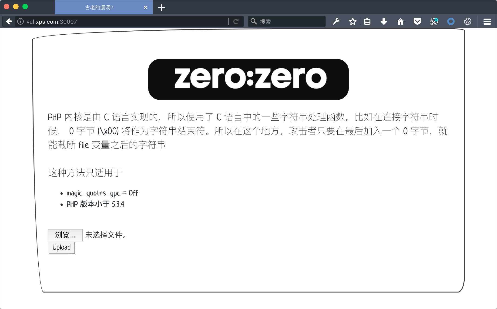

 

# 简介

直接使用别人的靶场总感觉不太好，那么就干脆自己写一个自己的文件上传靶场吧。正好博客之前也没有单独总结过文件上传的知识点，那么就顺便水一篇文章，岂不是一举两得。当然关于文件上传 upload-labs 总结的比较全面了，非强迫症患者建议直接去刷 upload-labs ，本文很多核心代码也都是直接用了 upload-labs 的轮子的…


**本项目的优势**：

1. Docker 一键部署很方便，可以灵活的导入到 CTFd 中
2. 题目更侧重于教学，注重对选手解题的引导，而不是一味地刁难选手
3. 配套保姆级 WP，妈妈再也不用担心不会解题啦
4. 前端界面在同行的衬托下没有那么丑

# 环境部署

**DockerHub 项目地址**：https://hub.docker.com/r/sqlsec/ggctf-upload

```bash
# 进入项目文件夹
cd upload-labs-docker

# 一键部署运行
docker-compose up -d
```

默认 13 个关卡运行的端口为 30001-30013 这 13 个端口上，如果要自定义端口信息的话，自行修改 docker-compose.yml 文件即可。

  

> 一共 13 个 Docker 容器，可能第一次部署需要一定的时间，有点硬伤， 耐心等待一下即可

# Writeup

配套的 Writeup 已经同步到国光的博客了：

[国光的文件上传靶场知识总结](https://www.sqlsec.com/2020/10/upload.html) 

当然也有一份 Github 本地的 [Writeup （点我查看）](./WP.md)

# 部分截图

 

 

 

  

...... 更多细节等待大家自己去探索反向，这里就不一一列举了。

# 参考资料

- [CTFHub](https://www.ctfhub.com/)
- [Github - c0ny1/upload-labs](https://github.com/c0ny1/upload-labs)
- [WooYun 乌云 - php imagecreatefrom* 系列函数之 png](https://wooyun.x10sec.org/static/drops/tips-16034.html)
- [Smi1e - Upload-labs 20关通关笔记](https://www.smi1e.top/upload-labs-20关通关笔记/)
- [先知 - upload-labs之pass 16详细分析](https://xz.aliyun.com/t/2657)
- [Encoding Web Shells in PNG IDAT chunks](https://www.idontplaydarts.com/2012/06/encoding-web-shells-in-png-idat-chunks/)


